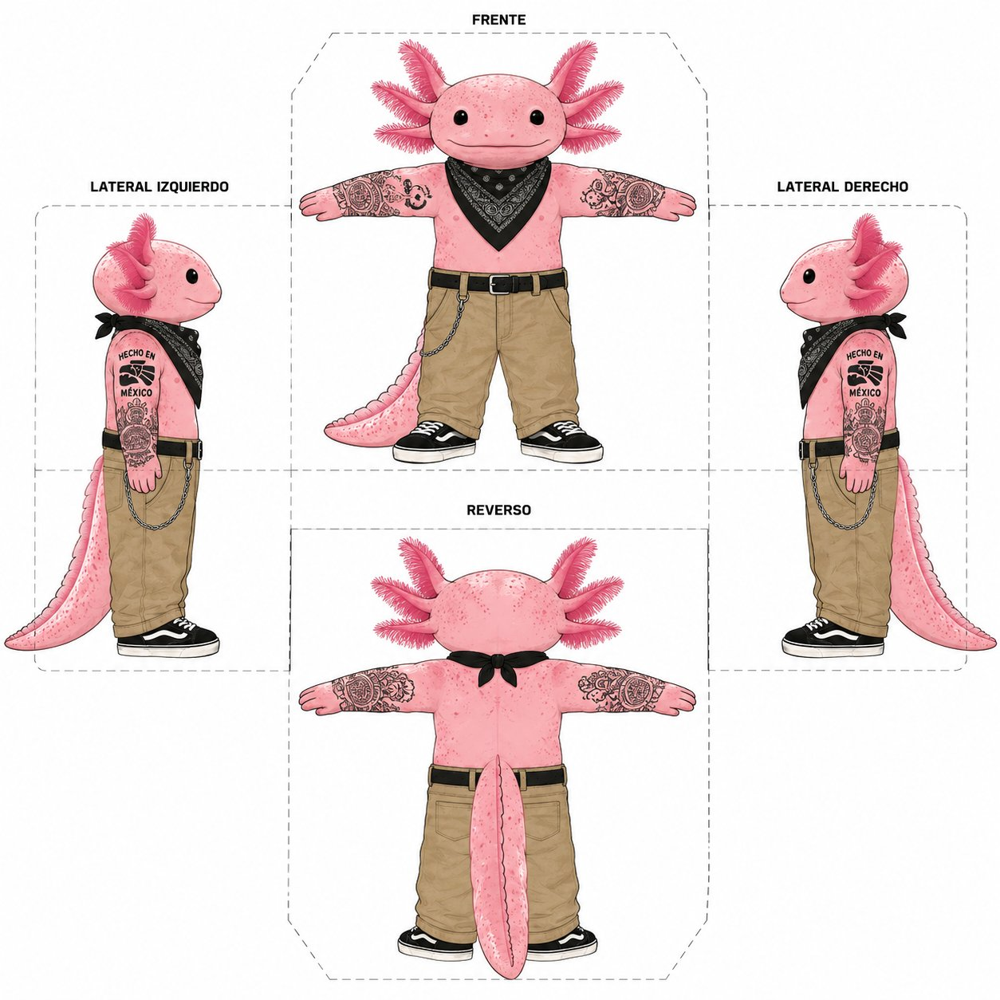

<div align="center">

# 🦎 Xolito


> *"Aquí estoy, cuidándote... y juzgándote con cariño."*

**Tu ajolote regañón para VS Code y la terminal.**  
Regañón. Tierno. Sarcástico. 100% mexicano. 0% filtro.


</div>

---

## ¿Qué es Xolito?

Xolito es una mascota virtual inspirada en el **ajolote mexicano** (*Ambystoma mexicanum*) — la especie endémica de México que nunca termina de madurar. Igual que nuestro código.

Vive en tu VS Code, detecta errores en tiempo real via LSP, y te regaña con cariño en español mexicano.

---

## 🎭 Moods

<div align="center">

| | | | | | |
|:---:|:---:|:---:|:---:|:---:|:---:|
| <br>**idle** | <br>**happy** | <br>**mad** | <br>**sassy** | <br>**worried** | <br>**panic** |

</div>

---

## ✨ Features

- 🔴 **Detecta errores LSP en tiempo real** — TypeScript, PHP, Python, Go, Rust, C#, Java
- 💬 **Comentarios inline con rotación** — frases distintas para cada tipo de error, sin repetirse
- 🧠 **Memoria entre archivos** — Xolito recuerda si en el archivo anterior también la regaste
- 🎨 **11 sprites por mood** — incluyendo `panic` con corbata para el jefe
- 📊 **Panel de stats de sesión** — errores, warnings, builds, archivos, tiempo y nivel de estrés
- 💼 **Modo Patrón** (`Shift+Esc`) — camufla tu pantalla cuando llega el jefe
- 🌶️ **Linter de Chambazos** — detecta spanglish en nombres de variables (`fetchUsuarios`, `get_datos`)
- 📈 **Sistema de estrés** — 5+ errores seguidos escalan el sarcasmo automáticamente
- 🕐 **Contexto dinámico** — viernes 4pm y fines de semana activan frases de descanso
- 🌙 **Eventos especiales** — coding nocturno, push a main, force push, merge conflicts
- 🔇 **Toggle silencio** — se calla cuando lo necesitas
- 🇲🇽 **100% mexicano** — frases en español con spanglish natural

---

## 💼 Modo Patrón

`Shift+Esc` cuando se acerque el jefe:

```
Antes:  trabajando en mi_proyecto_secreto.ts
Después: 💼 [PROD] cluster_matrix_balancer.cpp
```

Abre código C++ con templates avanzados, mutex y futuros. Al desactivar, regresa exactamente donde estabas.

---

## 📦 Instalación

### VS Code Marketplace

```
ext install xolito.xolito-vscode
```

### Desde código fuente

```bash
git clone https://github.com/JonatanJHL/pet_mexican.git xolito
cd xolito
pnpm install
cd packages/core && pnpm exec tsc
cd ../vscode && node build.mjs
# Presiona F5 en VS Code
```

---

## 💬 Frases de ejemplo

```
💼 Modo Patrón activado:
  "¡Disimula, disimula! ¡Ponte a leer código denso!"
  "¡No voltees! Mirada fija como hacker ruso."

🌶️ Linter spanglish:
  "fetchUsuarios. Mijo, consistencia. Elige un idioma."

😤 5+ errores seguidos:
  "El compilador te odia hoy. Respira."
  "Párate, respira, lee el error completo. En serio."

🍺 Viernes 4pm:
  "Viernes 4pm. Cierra el IDE y agarra una chela."

🔴 Error en otro archivo:
  "¿Vienes huyendo del otro archivo? Aquí también hay errores."

💀 Push a main:
  "¡Ay, cabrón! ¿Y el PR? ¿Lo dejaste en el carro?"

🌙 Coding nocturno:
  "Son las 11pm y sigues aquí. Tu cama también te quiere."
```

---

## 🗂 Estructura

```
xolito/
├── packages/
│   ├── core/              ← lógica central, frases, sprites SVG
│   │   └── src/
│   │       ├── phrases.ts         ← banco de frases por evento
│   │       ├── xolito.ts          ← clase principal + sistema de estrés
│   │       ├── types.ts           ← tipos y moods (incluye panic)
│   │       └── sprites/
│   │           └── generator.ts   ← generador SVG por mood
│   ├── vscode/            ← extensión VS Code
│   │   └── src/
│   │       ├── extension.ts       ← boss mode, linter spanglish, contexto dinámico
│   │       ├── decorations.ts     ← frases inline con rotación y memoria
│   │       └── diagnostics-watcher.ts
│   └── claude-code/       ← plugin de terminal
└── README.md
```

---

## 🤝 Contribuir frases

Las frases viven en dos archivos:

- **`packages/core/src/phrases.ts`** — notificaciones y panel (eventos como `build_fail`, `boss_alert`)
- **`packages/vscode/src/decorations.ts`** — comentarios inline en el editor

Ver la [guía completa de contribución](packages/vscode/README.md) con ejemplos, reglas de tono y tabla de eventos.

**Reglas básicas:**
1. Regañonas pero con cariño — las mamadas son de carnal, no de enemigo
2. Sarcasmo natural — que suene a cuate, no a IA
3. Español mexicano o spanglish — mezcla si se siente natural
4. Máximo 100 caracteres
5. Asigna el mood correcto

```bash
pnpm test           # 52+ tests
pnpm test:coverage  # con cobertura
```

---

## 📄 Licencia

MIT — Úsalo, modifícalo, ponle más frases.  
Xolito es de todos. Como el aguacate. 🥑

---

<div align="center">

*Hecho con 🦎 y mucho café en México*



</div>
